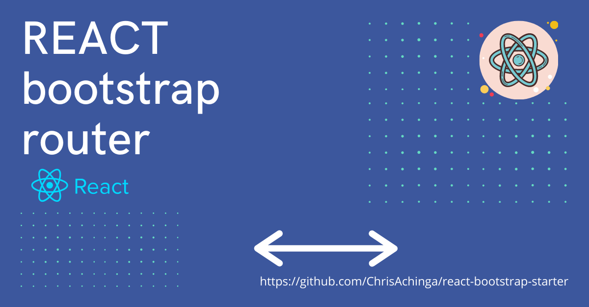
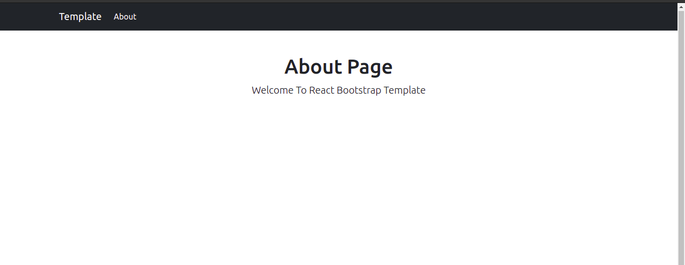
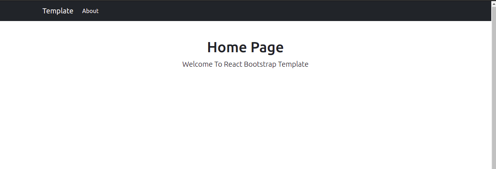
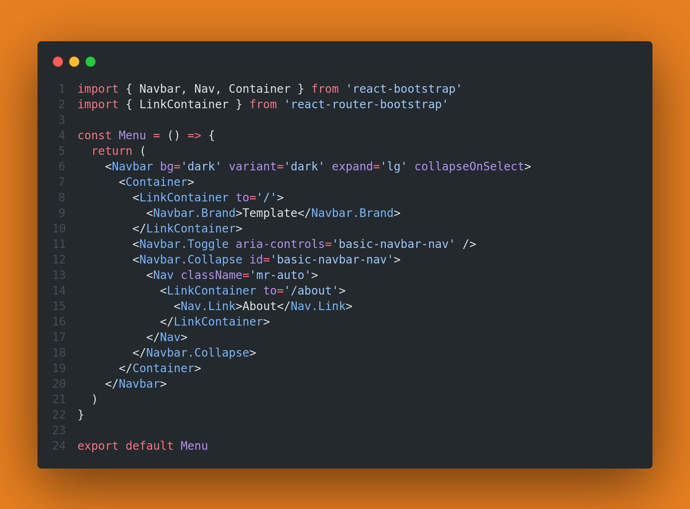
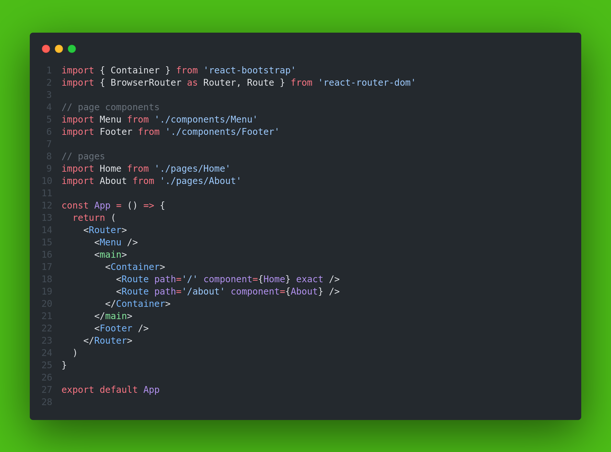

> This is an update to the previous article I wrote on [React & Bootstrap Starter Template](https://chrisdev.hashnode.dev/react-and-bootstrap-starter-template)

## Why a Template?

It's because they save time.

The process of setting up a project can be always frustrating and it's always repetitive. That's why I have a template for almost every stack I do.

# React & Bootstrap

I love using Bootstrap because of the almost Zero configuration and the hustle of designing a responsive web layout is taken care of so I just focus on how a site would look.

**Updates ...**

I wrote a similar article and after some updates here and there, I made a few changes and decided to re-write the article, of course after updating my template.

## Components:

I have 4 ready-to-use components:

1.  ### Meta

    ```js
    import { Helmet } from 'react-helmet'

    const Meta = ({ title }) => {
      return (
        <Helmet>
          <title>{title}</title>
        </Helmet>
      )
    }
    export default Meta
    ```

    This component imitates the `<title>` tag. I used [`react-helmet`](https://www.npmjs.com/package/react-helmet) to do that. This reusable React component will manage all of your changes to the document head.

2.  ### Header

    The Header component is the one that appears right below the navigation bar on the template:
    
    


    ```js
    import { Container } from 'react-bootstrap'
    const Header = ({ head, description }) => {
      return (
        <Container>
          <div className='starter-template text-center mt-5'>
            <h1>{head} Page</h1>
            <p className='lead text-capitalize'>{description}</p>
          </div>
        </Container>
      )
    }
    export default Header
    ```

    The header component is re-used in all pages, it takes in 2 props, title and description

    example:

    ```js
    <Header head={pageTitle} description={pageDescription} />
    ```

3.  ### Menu

    This is the navigation bar.

    

4.  ### Footer

    A normal footer component:

    ```js
      const Footer = () => {
      const year = new Date().getFullYear()
      return (
        <>
          <footer className='text-center text-capitalize'>
            copyright react bootstrap starter &copy; {year}
          </footer>
        </>
      )
    }
    export default Footer
    ```

## Pages

For the template, I used 2 sample pages: the landing page and about page.

1. Home Page
2. About Page

## Main App

I used react router-dom to set the two pages up.

